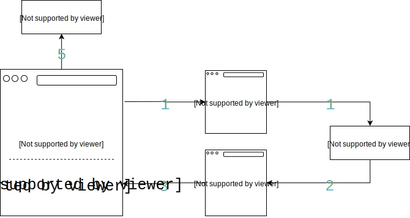

# Smartcar JS Client SDK [![Build Status][ci-image]][ci-url] [![GitHub tag][tag-image]][tag-url]

The official Smartcar JavaScript SDK.

## Overview

The [Smartcar API](https://smartcar.com/docs) lets you read vehicle data
(location, odometer) and send commands to vehicles (lock, unlock) using HTTP requests.

To make requests to a vehicle from a web application, the end user must connect their vehicle using [Smartcar Connect](https://smartcar.com/docs/api#smartcar-connect). The Smartcar JavaScript SDK provides an easy way to launch and handle Connect to retrieve the resulting `code`.

Before integrating with the JavaScript SDK, you'll need to register an application in the [Smartcar dashboard](https://dashboard.smartcar.com). Once you have registered an application, you will have a Client ID and Client Secret, which will allow you to authorize users.

## Installation

You can install the JavaScript SDK either using npm or through our CDN.

### npm

```shell
npm install @smartcar/auth
```

### Smartcar CDN

```html
<script src="https://javascript-sdk.smartcar.com/2.4.1/sdk.js"></script>
```

Before v2.2.0, the SDK was versioned as follows:
```html
<!-- Deprecated -->
<script src="https://javascript-sdk.smartcar.com/sdk-<version>.js"></script>
```

## SDK reference

For detailed documentation on parameters and available methods, please refer to
the [SDK reference](doc/).

## Flow

The SDK manages the front-end flow of the [OAuth authorization process](https://tools.ietf.org/html/rfc6749#section-4.1). The steps are as follows:

<p align="center"></p>

1. User clicks "Connect your car" button (or similar button) which creates a pop-up dialog with Connect.
   1. User selects the make of their vehicle.
   2. User is prompted to log in with their vehicle credentials.
   3. User is presented with a set of requested permissions to grant your application.
   4. User can either "Allow" or "Deny" your application's access to the set of permissions.
2. Connect redirects the user to the Smartcar JavaScript SDK redirect page along with the resulting `code`.
3. The redirect page sends the `code` to your application's window and closes the pop-up dialog.
4. Your JavaScript front end receives the `code` in the onComplete function registered in the SDK constructor. This function needs to communicate with your backend to exchange the code for access and refresh tokens.
5. Your application's back end server needs to accept the `code` and exchange it for an access token.

The SDK facilitates generating OAuth links, creating pop-up dialogs, and receiving authorization codes. This SDK will not assist you with exchanging authorization codes for an access token or making requests to vehicles. Please see our [back-end SDKs](https://smartcar.com/docs#backend-sdks) for more information on handling the access tokens and vehicle requests.

## Quick start

### 1. Register a JavaScript SDK redirect URI

The JavaScript SDK uses a special redirect URI to provide a simpler flow to retrieve authorization codes. The redirect URI takes the following form:

```
https://javascript-sdk.smartcar.com/v2/redirect?app_origin=<Your Application's Origin>
```
Note that the version number refers to the major version of the SDK you are using, so updating the SDK to a new major version requires updating your redirect URI in the Smartcar Dashboard accordingly.

The `app_origin` should be the location at which your website is located. The origin consists of the protocol and the host of your site only, without the resource path.

Before v2.2.0, redirect URIs were formatted as follows:

```
// Deprecated
https://javascript-sdk.smartcar.com/redirect-<version>?app_origin=<Your Application's Origin>
```
For more information on this deprecation, [see our documentation](https://smartcar.com/docs/guides/new-redirect-uri/).

Some example origins are:

#### Valid:
+ `https://example.com`
+ `https://myapp.example.com`
+ `http://localhost:8000`

#### Invalid:
+ `https://example.com/some/path`
+ `http://localhost:8000/some/path`
+ `http://localhost:8000?foo=bar#baz`

Once you have constructed your redirect URI, make sure to register it on the [Smartcar dashboard](https://dashboard.smartcar.com).

### 2. Initialize Smartcar

```javascript
const smartcar = new Smartcar({
  clientId: '<your-client-id>',
  redirectUri: '<your-redirect-uri>',
  scope: ['read_vehicle_info', 'read_odometer'],
  onComplete: function(err, code) {
    if (err) {
      // handle errors from Connect (i.e. user denies access)
    }
    // handle the returned code by sending it to your back-end server
    sendToBackend(code);
  },
});
```

**Reference:** [`new Smartcar(options)`](doc#new_Smartcar_new)

> NOTE: See the full set of available scopes for each endpoint in the [Smartcar API reference](https://smartcar.com/docs#get-all-vehicles) under "Required Permissions".

### 3. Launch Connect

Add a click handler to an HTML element:

```javascript
smartcar.addClickHandler({id: '#your-button-id'});
```

**Reference:** [`smartcar.addClickHandler(options)`](doc#Smartcar+addClickHandler)

Alternatively, you can launch Connect directly:

```javascript
smartcar.openDialog();
```

**Reference:** [`smartcar.openDialog(options)`](doc#Smartcar+openDialog)

## Advanced

In addition to the flow described above, you can use the JavaScript SDK in other ways too. The following section will cover some of these cases.

### Smartcar Connect URL generation

Normally the [`.addClickHandler()`](doc#Smartcar+addClickHandler) and [`.openDialog()`](doc#Smartcar+openDialog) methods are used to launch Connect. However, if you would like to generate the Connect URL directly, you can do so with the [`.getAuthUrl()`](doc#Smartcar+getAuthUrl) method.

```javascript
const url = smartcar.getAuthUrl();
```

**Reference:** [`smartcar.getAuthUrl(options)`](doc#Smartcar+getAuthUrl)

### Server-side redirect handling

In a traditional OAuth implementation, the redirect URI is normally set to your application's back end, rather than Smartcar's special JavaScript SDK redirect page described in the flow above. Instead of using the JavaScript SDK redirect page, you can still choose to use the traditional server-side architecture (described below). In this architecture you would receive the authorization code on a back-end route instead of the client-side `onComplete` callback.

To use the JavaScript SDK for this flow, do the following:

1. Set the `redirect_uri` parameter in the initialization to a route on your application's back-end server:

```javascript
const smartcar = new Smartcar({
  clientId: '<your-client-id>',
  redirectUri: '<your-backend-redirect-uri>',
  scope: ['read_vehicle_info', 'read_odometer'],
  onComplete: function() {},
});
```

Make sure to also register the URI on the [Smartcar dashboard](https://dashboard.smartcar.com).

2. On your `redirect_uri` route, you will need to accept the authorization code according to the query parameters documented in the [Smartcar API reference](https://smartcar.com/docs#3-handle-smartcar-response).

For example:

```
https://application-backend.com/page?code=90abecb6-e7ab-4b85-864a-e1c8bf67f2ad
```

Or in case of an error:

```
https://application-backend.com/page?error=access_denied&error_description=User+denied+access+to+application.
```

3. On the redirect route, you can render a page with the JavaScript SDK's redirect helper script. The script will invoke the `onComplete` callback and close out the Connect pop-up dialog.

```html
<script src="https://javascript-sdk.smartcar.com/v2/redirect.js"></script>
```

> NOTE: If the page serving the redirect script file does not have the original query parameters sent from Connect (`code`, `state`, `error`, `error_description`), then the `onComplete` callback will be invoked with no parameters.

## Contributing

When contributing to this repo, ensure that prior to your pull request you run the following commands: 

`npm run readme`
`npm run jsdoc`

[ci-url]: https://travis-ci.com/smartcar/javascript-sdk
[ci-image]: https://travis-ci.com/smartcar/javascript-sdk.svg?token=jMbuVtXPGeJMPdsn7RQ5&branch=master
[tag-url]: https://github.com/smartcar/javascript-sdk/tags
[tag-image]: https://img.shields.io/github/tag/smartcar/javascript-sdk.svg

<!-- Please do not modify or remove this, it is used by the build process -->
[version]: 2.4.1
